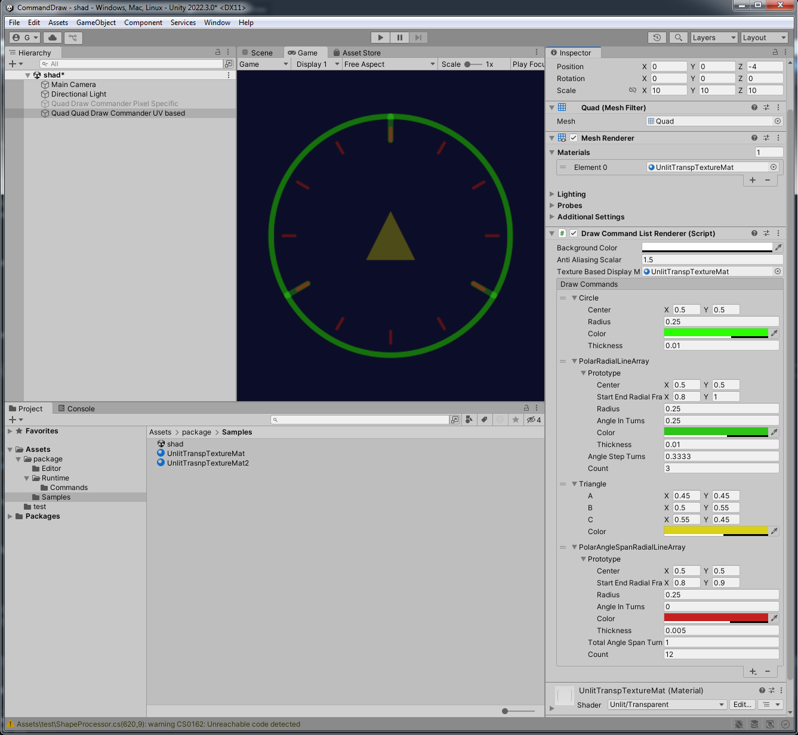

# CommandDraw

A Unity package for high-performance, GPU-based 2D shape rendering directly to textures using Signed Distance Fields (SDFs).

**CommandDraw** is an alternative to traditional CPU-based or immediate-mode rendering, allowing you to define complex 2D shapes (lines, arcs, rectangles, etc.) using high-level C# components which are automatically converted into GPU-ready command buffers and rasterized via a fragment shader. This enables complex, anti-aliased 2D graphics with minimal CPU overhead, suitable for procedural textures, UI backgrounds, or custom visual feedback.


| Status | Unity Version | Author |
| :--- | :--- | :--- |
| **Beta** | 2022.3+ | Glurth |

---

## 🚀 Key Features

* **GPU-Accelerated:** Rendering is performed entirely in a fragment shader using **Signed Distance Fields (SDFs)**, ensuring high performance and resolution-independent anti-aliasing.
* **Editor Workflow:** Fully integrated with the Unity Editor using a **`ReorderableList`** for easy management (adding, removing, reordering) of all draw commands.
* **Flexible Coordinate Systems:** Supports drawing using dynamic screen-space coordinates or fixed, normalized **[0, 1] UV space** (via `DrawCommandListRendererPixelBased`) for procedural texture generation.
* **Easy Abstraction:** High-level C# classes (e.g., `CircleDrawCommand`, `OrientedRectDrawCommand`) manage the complexity of packing data for the GPU.  The `BaseDrawCommand` abstract base class allows for user creation of custom draw commands.
* **Advanced Compositing:** Uses **pre-multiplied alpha blending** to composite overlapping shapes within the draw list.


---

## 📦 Installation

This package uses the Unity Package Manager (UPM) format.

1.  Open the **Package Manager** in Unity (`Window > Package Manager`).
2.  Click the **+** button in the top-left corner.
3.  Select **"Add package from git URL..."**
4.  Paste the repository URL (Replace with your actual repo URL when available):
    ```
    # [Insert your Git URL here]
    ```

---

## 📋 Usage: Defining the Scene

### 1. The Renderer Component

The core of the system is the **`DrawCommandListRenderer`** component.

1.  Create a new empty **GameObject** in your scene.
2.  Add the `DrawCommandListRenderer` component to it.
3.  Assign a **Display Material** to the `Texture Based Display Material` field (e.g., a standard Unity UI material that uses the `_MainTex` property).

The renderer will automatically handle the pipeline: finding the shader, allocating a `RenderTexture`, converting your commands, and running the fragment shader.

### 2. The Editor Interface

The custom editor allows you to manage the entire draw list visually.

* **Setup Properties:** Adjust the **`Background Color`** and the **`Anti Aliasing Scalar`** (which controls the sharpness of the SDF smoothing).
* **Managing Commands:** The **Draw Commands** section is a **ReorderableList**.
    * Click the **+** button to open a dropdown menu listing all available high-level shapes (Line, Arc, Disk, etc.).
    * Once added, each shape's properties (position, size, color) can be configured directly in the Inspector. The result updates in real-time.

### 3. Pixel-Based Rendering

To render into a fixed-size texture (e.g., $256 \times 256$ pixels for a game asset):

* Use the **`DrawCommandListRendererPixelBased`** component instead of the base class.
* Set the desired resolution using the **`Texture Size`** field.
* This renderer automatically normalizes all command coordinates and sizes into [0, 1] UV space before rendering, ensuring consistent scaling regardless of the final texture size.

---

## 🎨 Supported Draw Commands (SDF Primitives)

| High-Level Class | Target Primitive | Description |
| :--- | :--- | :--- |
| **`LineDrawCommand`** | `CMD_LINE` | A single straight line segment with thickness. |
| **`PolyLineDrawCommand`** | `CMD_LINE` (multi) | A connected series of line segments (a chain). |
| **`RadialLine`** | `CMD_LINE` | A line segment defined by a center, angle, and inner/outer radius fractions. |
| **`CircleDrawCommand`** | `CMD_ARC` | A complete circle outline. |
| **`ArcDrawCommand`** | `CMD_ARC` | A partial circle outline defined by a center, radius, and start/end angles. |
| **`DiskDrawCommand`** | `CMD_DISK` | A filled circle. |
| **`CapsuleDrawCommand`** | `CMD_CAPSULE` | A line segment with two rounded endpoints (a filled stadium shape). |
| **`RectDrawCommand`** | `CMD_RECT` | A filled, axis-aligned rectangle. |
| **`OrientedRectDrawCommand`** | `CMD_ORECT` | A filled rectangle that can be rotated. |
| **`RoundedRectDrawCommand`** | `CMD_RRECT` | A filled rectangle with independent corner radii for smooth corners. |
| **`TriangleDrawCommand`** | `CMD_TRIANGLE` | A filled triangle defined by three vertices. |
| **`CurveDrawCommand`** | `CMD_LINE` (multi) | A quadratic Bézier curve that is adaptively subdivided into multiple `CMD_LINE` segments for smooth rendering. |

---

## ⚙️ Technical Details

The package relies on two core, synchronized components:

1.  **`PackedDrawCommand` (C# Struct):** A memory-aligned struct used to pack spatial, color, and size data efficiently for the GPU via a `ComputeBuffer`.
2.  **`DrawCommand` (HLSL Struct):** The corresponding struct defined within the `Unlit/DrawListFragShader` to interpret the data.

The fragment shader iterates through all commands and uses the calculated Signed Distance ($d$) to blend the color of the shape onto the pixel, using:

$$
\text{alpha} = \text{smoothstep}(\text{pxAA}, 0, d - \frac{\text{thickness}}{2})
$$

where $\text{pxAA}$ is the screen-space anti-aliasing kernel size derived from $\text{fwidth}$.

---

## 🤝 Contributions

Contributions, issues, and feature requests are welcome and encouraged! Please submit them directly through the project's GitHub repository.  Note: due to licensing stuff, your explicit written permission must be granted before contributions can be included.

---


## Licensing

This package is licensed under the EyE Dual-Licensing Agreement.

This model provides free, perpetual use for Indie Developers and non-commercial projects (teams with annual revenue under $100,000 USD). Larger organizations or established game studios are required to purchase a Perpetual Commercial License (PCL) for each named commercial project.

Please review the full terms and conditions in the file [license.md] before commercial use.